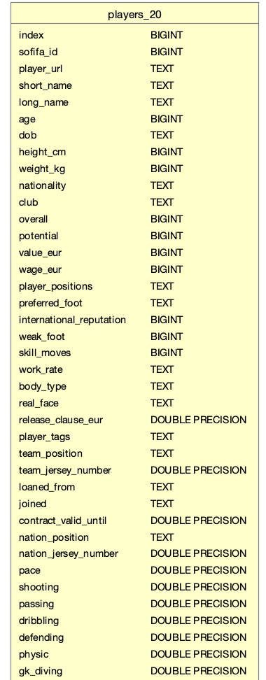
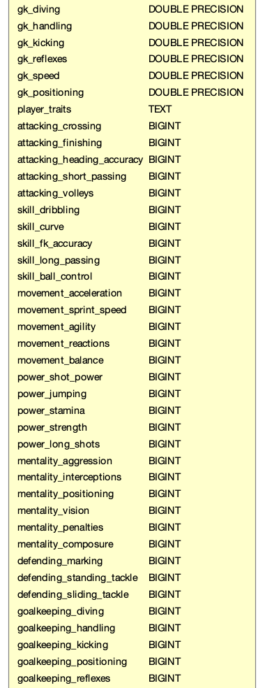
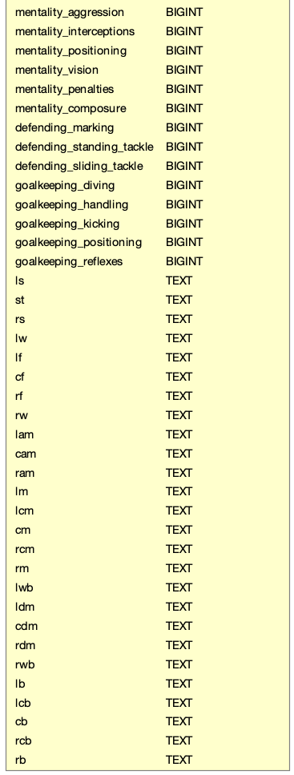

 
# Course Project 36650

This is a brief walkthrough for 36650 course project.

The entire code walkthrough video is available at:https://youtu.be/haPk_fX7a78

For this project, we are using the players_20.csv file from FIFA dataset which is available on Kaggle:(https://www.kaggle.com/stefanoleone992/fifa-20-complete-player-dataset?select=players_20.csv). This dataset contains Soccer player statistics for 2015-2020. In this project, only statistics for 2020 is used for our functions.

First, we download the players_20.csv data to our local machine. We plan to use pandas package in python to read the csv file into our POSTGRES database called pgadmin so that we can use SQL to look at the initial constraints and resulting tables in DB visualizer. The 'data' folder in this directory has the source python code used for data read-in process and the initial csv file for anyone wanting to try our application.  

Here is the screenshots of table infrastructure from DB Visualizer of our data:

From the screenshots, we see that there are three types of data: BIGINT, TEXT, DOUBLE PRECISION. These data types cannot be changed and might be used to test whether our input is valid in functions.  

Next, we are building five python functions to deal with the following requests, each function corresponds to the same number:

1.List the x players who achieved highest improvement across all skillsets.  
2. What are the y clubs that have largest number of players with contracts ending in 2021?  
3. List the z clubs with largest number of players in the dataset where z >= 5.  
4. What is the most popular nation_position and team_position in the dataset? (list the most popular for each).  
5. What is the most popular nationality for the players in the dataset?

Because the data is already in POSTGRES database, we would like to use SQL to look at the resulting tables after entering our commands first. The resulting tables by running query tools could be used to verify our python functions.  

Then, with the help of pandas package and psycopg2 package which links our python functions to sql database, we connect commands with databases while using conn.execute() command to wrap our SQL commands in python functions. Instead of returning tables, we created an empty list to store our results. With different input in integers, the output list could vary. The python functions, SQL commands, screenshots for resulting tables and lists are all located under src folder of course project directory.  

Last but not least, we are using unit tests to check the efficiency of our application while generating a coverage report for our functions. In our 'test' folder of course project, we have two test functions testing both the happy path: The length of resulting list and the correct output of our list from functions; sad path: Testing the edge cases of incorrect input values.After running our coverage command in terminal, the generated coverage reports indicates the passed 2 tests have 100% coverage for our application. 
Both test files and coverage report is included in 'test' folder.

